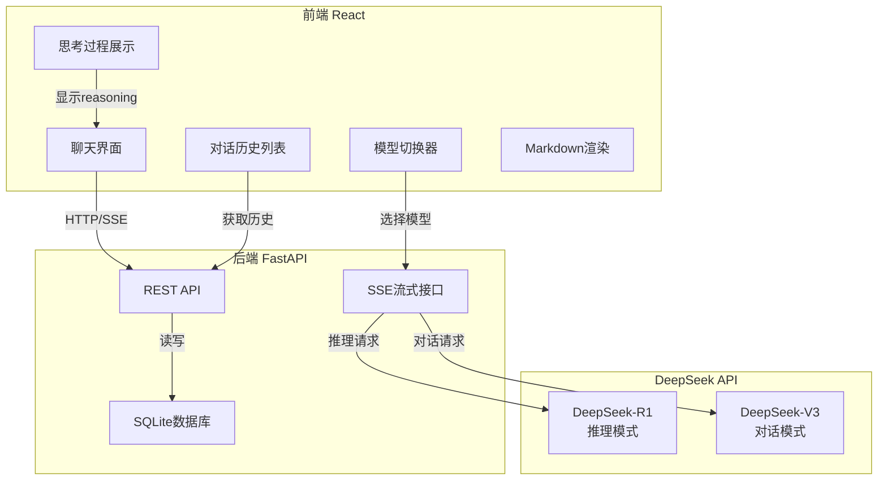
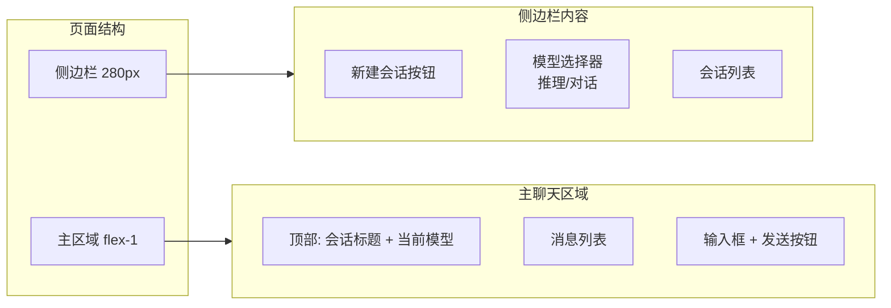
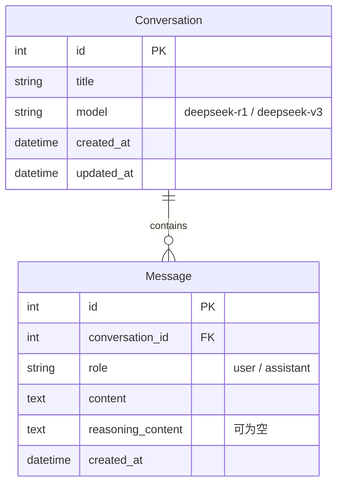

# 个人 DeepSeek 对话问答系统开发规划

## 技术架构总览



### 技术选型

- **后端**: Python FastAPI + SQLite + SQLAlchemy
- **前端**: React 18 + TypeScript + Vite + Tailwind CSS
- **LLM**: DeepSeek API
  - DeepSeek-R1: 推理模式 (带思考过程)
  - DeepSeek-V3: 对话模式
- **流式通信**: Server-Sent Events (SSE)

### DeepSeek 模型特点

| 模型 | 用途 | 特点 |
|------|------|------|
| DeepSeek-R1 | 推理模式 | 返回 `reasoning_content` (思考过程) + `content` (最终答案) |
| DeepSeek-V3 | 对话模式 | 仅返回 `content`，响应更快 |

---

# Phase 1: 项目初始化与健康检查

**目标**: 搭建前后端项目骨架，验证前后端通信正常

## 1.1 项目结构

```
project/
├── backend/
│   ├── app/
│   │   ├── __init__.py
│   │   ├── main.py              # FastAPI 应用入口
│   │   ├── config.py            # 配置管理
│   │   ├── database.py          # 数据库连接
│   │   ├── models/
│   │   │   └── models.py        # SQLAlchemy 模型
│   │   ├── routers/
│   │   │   ├── health.py        # 健康检查接口
│   │   │   ├── chat.py          # 对话接口
│   │   │   └── conversation.py  # 会话管理接口
│   │   ├── services/
│   │   │   └── deepseek_service.py  # DeepSeek 调用封装
│   │   └── schemas/
│   │       └── schemas.py       # Pydantic 模型
│   ├── requirements.txt
│   └── .env
│
└── frontend/
    ├── src/
    │   ├── App.tsx
    │   ├── main.tsx
    │   ├── components/
    │   ├── services/
    │   ├── types/
    │   └── index.css
    ├── package.json
    └── vite.config.ts
```

## 1.2 后端健康检查接口

`GET /api/health`:

```json
{
  "status": "ok",
  "timestamp": "2024-01-01T00:00:00Z",
  "version": "1.0.0"
}
```

## 1.3 前端健康检查

- 启动时调用 `/api/health`
- 显示连接状态指示器
- 配置 Vite 代理到后端

## 1.4 依赖

**后端**:
```
fastapi
uvicorn[standard]
python-dotenv
```

**前端**:
```json
{
  "dependencies": {
    "react": "^18.x",
    "react-dom": "^18.x"
  },
  "devDependencies": {
    "typescript": "^5.x",
    "vite": "^5.x",
    "@vitejs/plugin-react": "^4.x",
    "tailwindcss": "^3.x",
    "autoprefixer": "^10.x",
    "postcss": "^8.x"
  }
}
```

## 1.5 交付物

- 后端服务运行在 `http://localhost:8000`
- 前端开发服务器运行在 `http://localhost:5173`
- 前端成功调用后端健康检查接口
- Swagger 文档可访问 `/docs`

---

# Phase 2: 前端 UI 开发

**目标**: 完成所有前端 UI 组件，包含思考过程展示

## 2.1 页面布局



## 2.2 组件结构

```
src/components/
├── Layout.tsx              # 整体布局
├── Sidebar/
│   ├── Sidebar.tsx         # 侧边栏容器
│   ├── ModelSelector.tsx   # 模型切换 (推理/对话)
│   └── ConversationList.tsx # 会话列表
├── Chat/
│   ├── ChatWindow.tsx      # 聊天主区域
│   ├── MessageList.tsx     # 消息列表
│   ├── MessageItem.tsx     # 单条消息
│   ├── ThinkingBlock.tsx   # 思考过程展示 (可折叠)
│   ├── InputArea.tsx       # 输入框
│   └── MarkdownRenderer.tsx # Markdown 渲染
└── common/
    ├── Button.tsx
    └── Loading.tsx
```

## 2.3 思考过程展示组件

`ThinkingBlock.tsx` - 专为 DeepSeek-R1 推理模式设计:

```
┌─────────────────────────────────────────┐
│ 💭 思考过程                    [展开/折叠] │
├─────────────────────────────────────────┤
│ 让我分析一下这个问题...                   │
│ 首先，我们需要考虑...                     │
│ 然后，根据...                            │
│ ...                                      │
└─────────────────────────────────────────┘
```

特点:
- 默认折叠，点击展开
- 使用不同背景色区分 (浅灰/浅紫)
- 流式显示思考过程
- 思考完成后自动折叠

## 2.4 消息结构

```typescript
interface Message {
  id: number;
  role: 'user' | 'assistant';
  content: string;
  reasoning_content?: string;  // 仅推理模式有
  model?: 'deepseek-r1' | 'deepseek-v3';
  created_at: string;
}
```

## 2.5 模型选择器

```
┌──────────────────┐
│  🧠 推理模式      │  ← DeepSeek-R1
├──────────────────┤
│  💬 对话模式      │  ← DeepSeek-V3
└──────────────────┘
```

## 2.6 新增依赖

```json
{
  "dependencies": {
    "react-markdown": "^9.x",
    "remark-gfm": "^4.x",
    "react-syntax-highlighter": "^15.x"
  }
}
```

## 2.7 交付物

- 完整的聊天界面布局
- 模型切换 UI
- 思考过程展示组件 (可折叠)
- Markdown/代码高亮渲染
- 使用 Mock 数据验证所有 UI 效果

---

# Phase 3: 后端开发 (DeepSeek 集成)

**目标**: 完成后端 API，集成 DeepSeek 模型

## 3.1 数据库模型



## 3.2 会话管理 API

- `GET /api/conversations` - 获取会话列表
- `POST /api/conversations` - 创建新会话 (指定模型)
- `GET /api/conversations/{id}` - 获取会话详情
- `DELETE /api/conversations/{id}` - 删除会话
- `PUT /api/conversations/{id}/title` - 更新标题

## 3.3 DeepSeek 服务封装

`app/services/deepseek_service.py`:

```python
class DeepSeekService:
    BASE_URL = "https://api.deepseek.com"
    
    async def chat_stream(
        self, 
        messages: list, 
        model: str = "deepseek-chat"  # 或 "deepseek-reasoner"
    ):
        # 流式调用 DeepSeek API
        # 推理模式返回 reasoning_content + content
        # 对话模式仅返回 content
```

DeepSeek API 特点:
- API 格式兼容 OpenAI
- 推理模式使用 `deepseek-reasoner` 模型
- 对话模式使用 `deepseek-chat` 模型
- 推理模式流式返回包含 `reasoning_content` 字段

## 3.4 聊天 API

`POST /api/chat`:

请求体:
```json
{
  "conversation_id": 1,
  "message": "解释一下量子计算",
  "model": "deepseek-reasoner"
}
```

SSE 流式响应 (推理模式):
```
data: {"type": "reasoning", "content": "让我思考一下...", "done": false}
data: {"type": "reasoning", "content": "首先需要理解...", "done": false}
data: {"type": "content", "content": "量子计算是", "done": false}
data: {"type": "content", "content": "一种利用量子力学...", "done": false}
data: {"type": "done", "content": "", "done": true}
```

SSE 流式响应 (对话模式):
```
data: {"type": "content", "content": "量子计算是", "done": false}
data: {"type": "content", "content": "一种计算范式...", "done": false}
data: {"type": "done", "content": "", "done": true}
```

## 3.5 新增依赖

```
sqlalchemy
openai  # DeepSeek API 兼容 OpenAI SDK
sse-starlette
```

## 3.6 交付物

- 数据库模型和自动迁移
- 会话 CRUD 接口
- DeepSeek 流式聊天接口
- 支持推理模式和对话模式
- Swagger 文档可测试所有接口

---

# Phase 4: 前后端联调与双模型集成

**目标**: 完成前后端对接，实现完整的双模型对话功能

## 4.1 API 服务封装

`src/services/api.ts`:

```typescript
// 会话管理
export const conversationApi = {
  list: () => fetch('/api/conversations'),
  create: (model: ModelType) => fetch('/api/conversations', {...}),
  delete: (id: number) => fetch(`/api/conversations/${id}`, {...}),
};

// 聊天 (SSE)
export async function* streamChat(
  conversationId: number, 
  message: string,
  model: ModelType
) {
  // 处理 SSE 流式响应
  // 区分 reasoning 和 content 类型
}
```

## 4.2 SSE 流式接收

```typescript
type ModelType = 'deepseek-reasoner' | 'deepseek-chat';

interface StreamChunk {
  type: 'reasoning' | 'content' | 'done';
  content: string;
  done: boolean;
}

// 前端处理逻辑
async function handleSendMessage(message: string) {
  for await (const chunk of streamChat(conversationId, message, model)) {
    if (chunk.type === 'reasoning') {
      // 更新思考过程 UI
      setReasoningContent(prev => prev + chunk.content);
    } else if (chunk.type === 'content') {
      // 更新回复内容 UI
      setContent(prev => prev + chunk.content);
    }
  }
}
```

## 4.3 模型切换功能

- 侧边栏模型选择器
- 新建会话时选择模型
- 会话内显示当前模型标识
- 不同模型使用不同图标/颜色区分

## 4.4 状态管理

```typescript
interface ChatState {
  conversations: Conversation[];
  currentConversationId: number | null;
  messages: Message[];
  currentModel: ModelType;
  isStreaming: boolean;
  streamingReasoning: string;  // 流式思考过程
  streamingContent: string;    // 流式回复内容
}
```

## 4.5 错误处理 ✅ 已完成

### 已实现功能:

1. **Toast 通知系统**
   - 创建了 `Toast` 组件和 `ToastContext`
   - 支持 success/error/warning/info 四种类型
   - 自动消失 + 手动关闭
   - 滑入动画效果

2. **加载状态指示器**
   - 会话列表加载状态
   - 消息加载状态
   - 发送中状态

3. **API 请求失败提示**
   - 所有 API 操作都有错误提示
   - 用户友好的错误信息

4. **DeepSeek 限流处理**
   - 检测 429 限流错误
   - 检测 401/403 认证错误
   - 显示对应的错误提示

5. **网络断开重连**
   - 30 秒健康检查轮询
   - 断开连接时显示警告
   - 恢复连接时显示成功提示

6. **请求重试机制**
   - 自动重试失败的请求 (最多3次)
   - 指数退避策略
   - 5xx 错误自动重试

## 4.6 交付物

- 完整可用的双模型对话系统
- 推理模式显示思考过程
- 对话模式快速响应
- 会话历史持久化
- 流畅的用户体验

---

# 附录: 完整依赖清单

## 后端 requirements.txt

```
fastapi
uvicorn[standard]
sqlalchemy
openai
python-dotenv
sse-starlette
```

## 前端 package.json 依赖

```json
{
  "dependencies": {
    "react": "^18.x",
    "react-dom": "^18.x",
    "react-markdown": "^9.x",
    "remark-gfm": "^4.x",
    "react-syntax-highlighter": "^15.x"
  },
  "devDependencies": {
    "typescript": "^5.x",
    "vite": "^5.x",
    "@vitejs/plugin-react": "^4.x",
    "tailwindcss": "^3.x",
    "autoprefixer": "^10.x",
    "postcss": "^8.x",
    "@types/react": "^18.x",
    "@types/react-dom": "^18.x",
    "@types/react-syntax-highlighter": "^15.x"
  }
}
```

## 环境变量 (.env)

```
DEEPSEEK_API_KEY=your_api_key_here
DEEPSEEK_BASE_URL=https://api.deepseek.com
```
